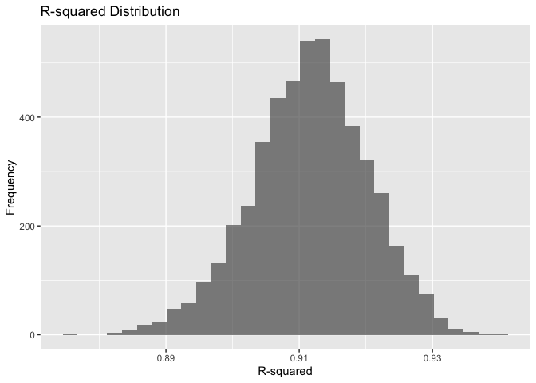
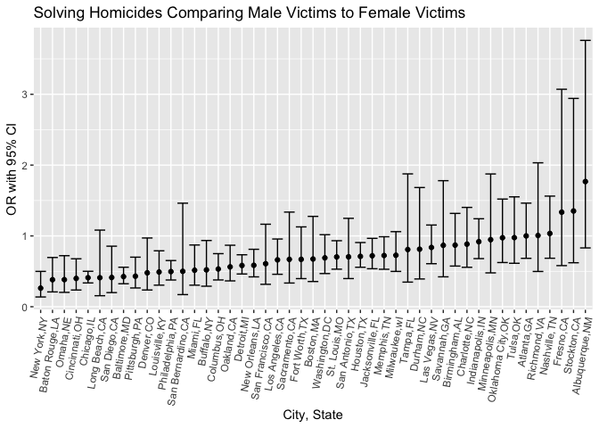

HW6
================
Shayne Estill (ske2118)

## Problem 1

``` r
weather_df = 
  rnoaa::meteo_pull_monitors(
    c("USW00094728"),
    var = c("PRCP", "TMIN", "TMAX"), 
    date_min = "2017-01-01",
    date_max = "2017-12-31") |>
  mutate(
    name = recode(id, USW00094728 = "CentralPark_NY"),
    tmin = tmin / 10,
    tmax = tmax / 10) |>
  select(name, id, everything())
```

    ## Registered S3 method overwritten by 'hoardr':
    ##   method           from
    ##   print.cache_info httr

    ## using cached file: /Users/shayneestill/Library/Caches/org.R-project.R/R/rnoaa/noaa_ghcnd/USW00094728.dly

    ## date created (size, mb): 2024-09-26 10:18:26.078569 (8.651)

    ## file min/max dates: 1869-01-01 / 2024-09-30

The boostrap is helpful when you’d like to perform inference for a
parameter / value / summary that doesn’t have an easy-to-write-down
distribution in the usual repeated sampling framework. We’ll focus on a
simple linear regression with tmax as the response and tmin as the
predictor, and are interested in the distribution of two quantities
estimated from these data:

𝑟̂ 2 log(𝛽̂ 0∗𝛽̂ 1) Use 5000 bootstrap samples and, for each bootstrap
sample, produce estimates of these two quantities. Plot the distribution
of your estimates, and describe these in words. Using the 5000 bootstrap
estimates, identify the 2.5% and 97.5% quantiles to provide a 95%
confidence interval for 𝑟̂ 2 and log(𝛽̂ 0∗𝛽̂ 1) . Note: broom::glance() is
helpful for extracting 𝑟̂ 2 from a fitted regression, and broom::tidy()
(with some additional wrangling) should help in computing log(𝛽̂ 0∗𝛽̂ 1).

``` r
boot_results <- weather_df |> 
  modelr::bootstrap(n = 5000) |> 
  mutate(
    models = map(strap, ~ lm(tmax ~ tmin, data = .x)),
    r_squared = map_dbl(models, ~ broom::glance(.x)$r.squared),
    log_beta0_beta1 = map_dbl(models, function(model) {
      coefs <- broom::tidy(model)
      beta0 <- coefs$estimate[coefs$term == "(Intercept)"]
      beta1 <- coefs$estimate[coefs$term == "tmin"]
      log(beta0 * beta1)
    })
  )
```

``` r
r_squared_plot <- ggplot(boot_results, aes(x = r_squared)) +
  geom_histogram(alpha = 0.7) +
  labs(title = "R-squared Distribution", x = "R-squared", y = "Frequency")

r_squared_plot
```

    ## `stat_bin()` using `bins = 30`. Pick better value with `binwidth`.

<!-- --> The r_squared
plot distribution histogram is fairly symmetrically distribution around
r_squared value of 0.915.

``` r
log_beta_plot <- ggplot(boot_results, aes(x = log_beta0_beta1)) +
  geom_histogram(alpha = 0.7) +
  labs(title = "log(beta0 * beta1) Distribution", x = "log(beta0 * beta1)", y = "Frequency")

log_beta_plot
```

    ## `stat_bin()` using `bins = 30`. Pick better value with `binwidth`.

<!-- --> The log_beta
plot distribution histogram is fairly symmetrically distributed around
log(beta0\*beta1) value of 2.02.

``` r
boot_results_CI = 
  boot_results |>
  summarize(
ci_r_squared = quantile(r_squared, c(0.025, 0.975)), 
ci_log_beta = quantile(log_beta0_beta1, c(0.025, 0.975))
)
```

    ## Warning: Returning more (or less) than 1 row per `summarise()` group was deprecated in
    ## dplyr 1.1.0.
    ## ℹ Please use `reframe()` instead.
    ## ℹ When switching from `summarise()` to `reframe()`, remember that `reframe()`
    ##   always returns an ungrouped data frame and adjust accordingly.
    ## Call `lifecycle::last_lifecycle_warnings()` to see where this warning was
    ## generated.

## Problem 2

The Washington Post has gathered data on homicides in 50 large U.S.
cities and made the data available through a GitHub repository here. You
can read their accompanying article here.

Create a city_state variable (e.g. “Baltimore, MD”), and a binary
variable indicating whether the homicide is solved. Omit cities Dallas,
TX; Phoenix, AZ; and Kansas City, MO – these don’t report victim race.
Also omit Tulsa, AL – this is a data entry mistake. For this problem,
limit your analysis those for whom victim_race is white or black. Be
sure that victim_age is numeric.

``` r
usa_df = 
   read_csv("data/homicide-data.csv", na = c("NA", ".", "")) |>
  mutate(city_state = str_c(city, state, sep = ",")) |>
   mutate(resolved = 
           as.numeric(disposition == "Closed by arrest")) |>
  filter(!city_state %in% c("Dallas,TX", "Phoenix,AZ", 
                            "Kansas City,MO", "Tulsa,AL")) |>
  filter(victim_race %in% c("White", "Black")) |>
  mutate(victim_age = as.numeric(victim_age)) 
```

    ## Rows: 52179 Columns: 12
    ## ── Column specification ────────────────────────────────────────────────────────
    ## Delimiter: ","
    ## chr (9): uid, victim_last, victim_first, victim_race, victim_age, victim_sex...
    ## dbl (3): reported_date, lat, lon
    ## 
    ## ℹ Use `spec()` to retrieve the full column specification for this data.
    ## ℹ Specify the column types or set `show_col_types = FALSE` to quiet this message.

    ## Warning: There was 1 warning in `mutate()`.
    ## ℹ In argument: `victim_age = as.numeric(victim_age)`.
    ## Caused by warning:
    ## ! NAs introduced by coercion

For the city of Baltimore, MD, use the glm function to fit a logistic
regression with resolved vs unresolved as the outcome and victim age,
sex and race as predictors. Save the output of glm as an R object; apply
the broom::tidy to this object; and obtain the estimate and confidence
interval of the adjusted odds ratio for solving homicides comparing male
victims to female victims keeping all other variables fixed.

``` r
baltimore_glm = 
  usa_df |>
  filter(city_state == "Baltimore,MD") |>
  glm(resolved ~ victim_age + victim_sex + victim_race, data = _, family = binomial()) 
```

``` r
baltimore_glm |> 
  broom::tidy(conf.int = TRUE) |> 
  mutate(OR = exp(estimate),
         CI_low = exp(conf.low),
         CI_high = exp(conf.high)) |>
  filter(term == "victim_sexMale") |>
  select(term, OR, CI_low, CI_high) |> 
  knitr::kable(digits = 3)
```

| term           |    OR | CI_low | CI_high |
|:---------------|------:|-------:|--------:|
| victim_sexMale | 0.426 |  0.324 |   0.558 |

The odds of solving homicides for male victims is 0.426 times the odds
of solving homicides for female victims is 0.426, adjusting for sex and
race. The 95% confidence interval is (0.324, 0.558).

Now run glm for each of the cities in your dataset, and extract the
adjusted odds ratio (and CI) for solving homicides comparing male
victims to female victims. Do this within a “tidy” pipeline, making use
of purrr::map, list columns, and unnest as necessary to create a
dataframe with estimated ORs and CIs for each city.

``` r
usa_glm = usa_df |>
  mutate(
    victim_race = fct_relevel(victim_race, "White"), 
    victim_sex = fct_relevel(victim_sex, "Female")) |>
  select(city_state, resolved, victim_age, victim_sex, victim_race) |>
    group_by(city_state) |>
  nest() |>
  mutate(
    city_model = map(data, ~glm(resolved ~ victim_age + victim_sex + victim_race , data = ., family = binomial())),
    city_results = map(city_model, broom::tidy)) |>
  unnest(city_results) |> 
  mutate( 
    OR = exp(estimate), 
    CI_low = exp(estimate - (1.96*std.error)) , 
    CI_high = exp(estimate + (1.96*std.error)), 
    ) |>
  select(city_state, term, OR, CI_low, CI_high) |>
  filter(
    term == "victim_sexMale") |>
  select(city_state, OR, CI_low, CI_high) 

knitr::kable(usa_glm, digits = 3)
```

| city_state        |    OR | CI_low | CI_high |
|:------------------|------:|-------:|--------:|
| Albuquerque,NM    | 1.767 |  0.831 |   3.761 |
| Atlanta,GA        | 1.000 |  0.684 |   1.463 |
| Baltimore,MD      | 0.426 |  0.325 |   0.558 |
| Baton Rouge,LA    | 0.381 |  0.209 |   0.695 |
| Birmingham,AL     | 0.870 |  0.574 |   1.318 |
| Boston,MA         | 0.674 |  0.356 |   1.276 |
| Buffalo,NY        | 0.521 |  0.290 |   0.935 |
| Charlotte,NC      | 0.884 |  0.557 |   1.403 |
| Chicago,IL        | 0.410 |  0.336 |   0.501 |
| Cincinnati,OH     | 0.400 |  0.236 |   0.677 |
| Columbus,OH       | 0.532 |  0.378 |   0.750 |
| Denver,CO         | 0.479 |  0.236 |   0.971 |
| Detroit,MI        | 0.582 |  0.462 |   0.734 |
| Durham,NC         | 0.812 |  0.392 |   1.683 |
| Fort Worth,TX     | 0.669 |  0.397 |   1.127 |
| Fresno,CA         | 1.335 |  0.580 |   3.071 |
| Houston,TX        | 0.711 |  0.558 |   0.907 |
| Indianapolis,IN   | 0.919 |  0.679 |   1.242 |
| Jacksonville,FL   | 0.720 |  0.537 |   0.966 |
| Las Vegas,NV      | 0.837 |  0.608 |   1.154 |
| Long Beach,CA     | 0.410 |  0.156 |   1.082 |
| Los Angeles,CA    | 0.662 |  0.458 |   0.956 |
| Louisville,KY     | 0.491 |  0.305 |   0.790 |
| Memphis,TN        | 0.723 |  0.529 |   0.988 |
| Miami,FL          | 0.515 |  0.304 |   0.872 |
| Milwaukee,wI      | 0.727 |  0.499 |   1.060 |
| Minneapolis,MN    | 0.947 |  0.478 |   1.875 |
| Nashville,TN      | 1.034 |  0.685 |   1.562 |
| New Orleans,LA    | 0.585 |  0.422 |   0.811 |
| New York,NY       | 0.262 |  0.138 |   0.499 |
| Oakland,CA        | 0.563 |  0.365 |   0.868 |
| Oklahoma City,OK  | 0.974 |  0.624 |   1.520 |
| Omaha,NE          | 0.382 |  0.203 |   0.721 |
| Philadelphia,PA   | 0.496 |  0.378 |   0.652 |
| Pittsburgh,PA     | 0.431 |  0.265 |   0.700 |
| Richmond,VA       | 1.006 |  0.498 |   2.033 |
| San Antonio,TX    | 0.705 |  0.398 |   1.249 |
| Sacramento,CA     | 0.669 |  0.335 |   1.337 |
| Savannah,GA       | 0.867 |  0.422 |   1.780 |
| San Bernardino,CA | 0.500 |  0.171 |   1.462 |
| San Diego,CA      | 0.413 |  0.200 |   0.855 |
| San Francisco,CA  | 0.608 |  0.317 |   1.165 |
| St. Louis,MO      | 0.703 |  0.530 |   0.932 |
| Stockton,CA       | 1.352 |  0.621 |   2.942 |
| Tampa,FL          | 0.808 |  0.348 |   1.876 |
| Tulsa,OK          | 0.976 |  0.614 |   1.552 |
| Washington,DC     | 0.690 |  0.468 |   1.017 |

Create a plot that shows the estimated ORs and CIs for each city.
Organize cities according to estimated OR, and comment on the plot.

``` r
  usa_glm_plot = 
  usa_glm |>
  ggplot(aes(x = fct_reorder(city_state, OR), y = OR)) + 
  geom_point() + 
  geom_errorbar(aes(ymin = CI_low, ymax = CI_high)) +
  theme(axis.text.x = element_text(angle = 80, hjust = 1)) +
  labs(title = "Solving Homicides Comparing Male Victims to Female Victims",
  x = "City, State", 
  y = "OR with 95% CI")

usa_glm_plot
```

<!-- -->

New York, NY has the lowest odds of solved homicides for males compared
to female victims, adjusted for race and age, whereas Aluquerque, NM has
the highest odds of solved homicides for males compared to female
victims, adjusting for race and age. The confidence intervals for
Fresno, CA, Stockton, CA, Albuquerque, NM are very very large where the
confidence intervals for the lower OR cities tend to be much smaller. It
is important to note than many of the confidence intervals contain the
null value of 1, thus suggesting a lack of evidence of a difference in
oddds of solve homicides by gender, adjusting for race and age.

## Problem 3

In this problem, you will analyze data gathered to understand the
effects of several variables on a child’s birthweight. This dataset,
available here, consists of roughly 4000 children and includes the
following variables:

babysex: baby’s sex (male = 1, female = 2) bhead: baby’s head
circumference at birth (centimeters) blength: baby’s length at birth
(centimeteres) bwt: baby’s birth weight (grams) delwt: mother’s weight
at delivery (pounds) fincome: family monthly income (in hundreds,
rounded) frace: father’s race (1 = White, 2 = Black, 3 = Asian, 4 =
Puerto Rican, 8 = Other, 9 = Unknown) gaweeks: gestational age in weeks
malform: presence of malformations that could affect weight (0 = absent,
1 = present) menarche: mother’s age at menarche (years) mheigth:
mother’s height (inches) momage: mother’s age at delivery (years) mrace:
mother’s race (1 = White, 2 = Black, 3 = Asian, 4 = Puerto Rican, 8 =
Other) parity: number of live births prior to this pregnancy pnumlbw:
previous number of low birth weight babies pnumgsa: number of prior
small for gestational age babies ppbmi: mother’s pre-pregnancy BMI ppwt:
mother’s pre-pregnancy weight (pounds) smoken: average number of
cigarettes smoked per day during pregnancy wtgain: mother’s weight gain
during pregnancy (pounds) Load and clean the data for regression
analysis (i.e. convert numeric to factor where appropriate, check for
missing data, etc.).

Propose a regression model for birthweight. This model may be based on a
hypothesized structure for the factors that underly birthweight, on a
data-driven model-building process, or a combination of the two.
Describe your modeling process and show a plot of model residuals
against fitted values – use add_predictions and add_residuals in making
this plot.

``` r
baby_birthweight = 
   read_csv("data/birthweight.csv") |>
   mutate(
     babysex = 
        case_match(babysex,
                    1 ~ "male",
                    2 ~ "female"
        ),
     babysex = fct_infreq(babysex), 
     frace = 
       case_match(frace,
                  1 ~ "White", 
                  2 ~ "Black", 
                  3 ~ "Asian", 
                  4 ~ "Puerto Rican", 
                  8 ~ "Other", 
                  9 ~ "Unknown"),
     frace = fct_infreq(frace),
     malform = 
       case_match(malform,
                  0 ~ "absent", 
                  1 ~ "present"),
    malform = fct_infreq(malform),
     mrace = 
       case_match(mrace,
                  1 ~ "White", 
                  2 ~ "Black", 
                  3 ~ "Asian", 
                  4 ~ "Puerto Rican", 
                  8 ~ "Other"),
     mrace = fct_infreq(mrace)
     )
```

    ## Rows: 4342 Columns: 20
    ## ── Column specification ────────────────────────────────────────────────────────
    ## Delimiter: ","
    ## dbl (20): babysex, bhead, blength, bwt, delwt, fincome, frace, gaweeks, malf...
    ## 
    ## ℹ Use `spec()` to retrieve the full column specification for this data.
    ## ℹ Specify the column types or set `show_col_types = FALSE` to quiet this message.

``` r
model_smoken_momage = lm(bwt ~ smoken + momage, data = baby_birthweight)

model_smoken_momage |> 
  broom::tidy() |> 
  knitr::kable(digits = 3)
```

| term        | estimate | std.error | statistic | p.value |
|:------------|---------:|----------:|----------:|--------:|
| (Intercept) | 2757.689 |    40.916 |    67.399 |       0 |
| smoken      |   -5.971 |     1.039 |    -5.747 |       0 |
| momage      |   18.792 |     1.985 |     9.469 |       0 |

Based on brief literature search, mother’s smoking status and mother’s
age at time of birth tend to be associated with baby’s birthweight.
Smoken and momage both appear to be significant with p-values less than
0.05.

``` r
modelr::add_residuals(baby_birthweight, model_smoken_momage)
```

    ## # A tibble: 4,342 × 21
    ##    babysex bhead blength   bwt delwt fincome frace gaweeks malform menarche
    ##    <fct>   <dbl>   <dbl> <dbl> <dbl>   <dbl> <fct>   <dbl> <fct>      <dbl>
    ##  1 female     34      51  3629   177      35 White    39.9 absent        13
    ##  2 male       34      48  3062   156      65 Black    25.9 absent        14
    ##  3 female     36      50  3345   148      85 White    39.9 absent        12
    ##  4 male       34      52  3062   157      55 White    40   absent        14
    ##  5 female     34      52  3374   156       5 White    41.6 absent        13
    ##  6 male       33      52  3374   129      55 White    40.7 absent        12
    ##  7 female     33      46  2523   126      96 Black    40.3 absent        14
    ##  8 female     33      49  2778   140       5 White    37.4 absent        12
    ##  9 male       36      52  3515   146      85 White    40.3 absent        11
    ## 10 male       33      50  3459   169      75 Black    40.7 absent        12
    ## # ℹ 4,332 more rows
    ## # ℹ 11 more variables: mheight <dbl>, momage <dbl>, mrace <fct>, parity <dbl>,
    ## #   pnumlbw <dbl>, pnumsga <dbl>, ppbmi <dbl>, ppwt <dbl>, smoken <dbl>,
    ## #   wtgain <dbl>, resid <dbl>

``` r
modelr::add_predictions(baby_birthweight, model_smoken_momage)
```

    ## # A tibble: 4,342 × 21
    ##    babysex bhead blength   bwt delwt fincome frace gaweeks malform menarche
    ##    <fct>   <dbl>   <dbl> <dbl> <dbl>   <dbl> <fct>   <dbl> <fct>      <dbl>
    ##  1 female     34      51  3629   177      35 White    39.9 absent        13
    ##  2 male       34      48  3062   156      65 Black    25.9 absent        14
    ##  3 female     36      50  3345   148      85 White    39.9 absent        12
    ##  4 male       34      52  3062   157      55 White    40   absent        14
    ##  5 female     34      52  3374   156       5 White    41.6 absent        13
    ##  6 male       33      52  3374   129      55 White    40.7 absent        12
    ##  7 female     33      46  2523   126      96 Black    40.3 absent        14
    ##  8 female     33      49  2778   140       5 White    37.4 absent        12
    ##  9 male       36      52  3515   146      85 White    40.3 absent        11
    ## 10 male       33      50  3459   169      75 Black    40.7 absent        12
    ## # ℹ 4,332 more rows
    ## # ℹ 11 more variables: mheight <dbl>, momage <dbl>, mrace <fct>, parity <dbl>,
    ## #   pnumlbw <dbl>, pnumsga <dbl>, ppbmi <dbl>, ppwt <dbl>, smoken <dbl>,
    ## #   wtgain <dbl>, pred <dbl>

``` r
baby_birthweight |> 
  modelr::add_residuals(model_smoken_momage) |>
  modelr::add_predictions(model_smoken_momage) |> 
  ggplot(aes(x = resid, y = pred)) + geom_point() + 
 labs(title = "Model_smoken_momage Residuals Against Fitted Values")
```

<!-- -->

This plot shows the model_smoken_momage regression plot of model
residuals against fitted values. The points appear mostly equally
distributed around residual = 0 with a possible slight left skew.

Compare your model to two others:

One using length at birth and gestational age as predictors (main
effects only) One using head circumference, length, sex, and all
interactions (including the three-way interaction) between these Make
this comparison in terms of the cross-validated prediction error; use
crossv_mc and functions in purrr as appropriate.

Note that although we expect your model to be reasonable, model building
itself is not a main idea of the course and we don’t necessarily expect
your model to be “optimal”.

``` r
model_blength_gaweeks = lm(bwt ~ blength + gaweeks, data = baby_birthweight)
```

``` r
model_bhead_blength_babysex = lm(bwt ~ bhead + blength + babysex + bhead*blength*babysex, data = baby_birthweight)
```

``` r
cv_df = 
  crossv_mc(baby_birthweight, 100) |> 
  mutate(
    train = map(train, as_tibble),
    test = map(test, as_tibble)
  )
```

``` r
cv_df |> 
  pull(train) |> 
  nth(3) |> 
  as_tibble()
```

    ## # A tibble: 3,473 × 20
    ##    babysex bhead blength   bwt delwt fincome frace gaweeks malform menarche
    ##    <fct>   <dbl>   <dbl> <dbl> <dbl>   <dbl> <fct>   <dbl> <fct>      <dbl>
    ##  1 male       34      48  3062   156      65 Black    25.9 absent        14
    ##  2 female     36      50  3345   148      85 White    39.9 absent        12
    ##  3 male       34      52  3062   157      55 White    40   absent        14
    ##  4 female     34      52  3374   156       5 White    41.6 absent        13
    ##  5 female     33      46  2523   126      96 Black    40.3 absent        14
    ##  6 male       36      52  3515   146      85 White    40.3 absent        11
    ##  7 male       33      50  3459   169      75 Black    40.7 absent        12
    ##  8 female     35      51  3317   130      55 White    43.4 absent        13
    ##  9 female     35      48  3175   158      75 White    39.7 absent        13
    ## 10 male       36      53  3629   147      75 White    41.3 absent        11
    ## # ℹ 3,463 more rows
    ## # ℹ 10 more variables: mheight <dbl>, momage <dbl>, mrace <fct>, parity <dbl>,
    ## #   pnumlbw <dbl>, pnumsga <dbl>, ppbmi <dbl>, ppwt <dbl>, smoken <dbl>,
    ## #   wtgain <dbl>

``` r
cv_res_df =
  cv_df |> 
  mutate(
    model_one = map(train, \(df) lm(bwt ~ smoken + momage, data = df)),
    model_two = map(train, \(df) lm(bwt ~ blength + gaweeks, data = df)),
    model_three = map(train, \(df) lm(bwt ~ bhead + blength + babysex + bhead*blength*babysex, data = df))) |> 
  mutate(
    rmse_one = map2_dbl(model_one, test, rmse),
    rmse_two = map2_dbl(model_two, test, rmse),
    rmse_three = map2_dbl(model_three, test, rmse)
  )
```

Look at RMSE distribution.

``` r
cv_res_df |> 
  select(starts_with("rmse")) |> 
  pivot_longer(
    everything(),
    names_to = "model", 
    values_to = "rmse",
    names_prefix = "rmse_"
  ) |> 
  ggplot(aes(x = model, y = rmse)) + 
  geom_violin() 
```

<!-- -->

Model one has the highest rmse, whereas model two has the second highest
rmse and model three has the lowest rmse. Model three, the model using
using head circumference, length, sex, and all interactions (including
the three-way interaction) is likely the best fit model.
